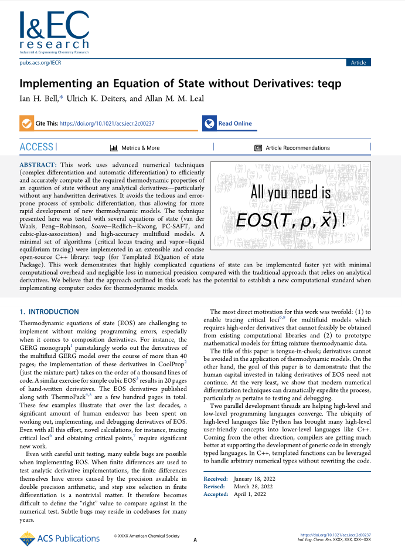

# Intro

This library implements advanced derivative techniques to allow for implementation of EOS without any hand-written derivatives.  The name TEQP comes from Templated Equation of State Package.  A paper about teqp is published in [Ind. Eng. Chem. Res.](https://doi.org/10.1021/acs.iecr.2c00237):



Why?

* Implementing an EOS is an error-prone and boring exercise. Automatic differentiation packages are a mature solution for calculating derivatives 
* Algorithms that *use* the EOS can be implemented in a very generic way that is model-agnostic
* ``teqp`` is very fast because it is written in C++, see the profiling in the paper in [Ind. Eng. Chem. Res.](https://doi.org/10.1021/acs.iecr.2c00237)

So far the following EOS are implemented:

* cubic:
    * van der Waals
    * Peng-Robinson
    * Soave-Redlich-Kwong
    * quantum-corrected Peng-Robinson for cryogens
* SAFT*ish*:
    * PC-SAFT (+dipoles, +quadrupoles) and association
    * SAFT-VR-Mie and association
    * cubic plus association (CPA)
* model fluids
    * Exp-6 (modified Buckingham) from Kataoka
    * square-well from Espíndola-Heredia et al.
    * Two-center Lennard-Jones models (+dipoles, +quadrupoles)
* multiparameter
    * multi-fluid model in the form of GERG
    * GERG-2004 and GERG-2008
    * ammonia+water model of Tillner-Roth and Friend
* Lee-Kesler-Plöcker

What is teqp *not*?:

* A feature-rich property library like NIST REFPROP. It is not intended to be, and other packages will be written that allow for the development of new algorithms. You are also welcome to write your own based upon ``teqp``.
* Written in a new and exciting programming language like [Clapeyron.jl](https://github.com/ClapeyronThermo/Clapeyron.jl) or [FeOS](https://github.com/feos-org/feos).  C++ is a mature and stable language that can be readily embedded into other environments or code bases via shared libraries.

Docs are on ReadTheDocs: [](https://teqp.readthedocs.io/en/latest/?badge=latest)

Written by Ian Bell, NIST, with the help of colleagues and collaborators

## Changelog

[](https://badge.fury.io/py/teqp)

* 0.22.0:

  * Features:

    * Addition of generalized multiphase equilibria routinews
    * Add the capability to combine AC models and the multifluid model as proposed in the works of A. Jaeger

  * Issues closed:

    * [#142](https://github.com/usnistgov/teqp/issues/142) : Ph for known to be two-phase mixtures
    * [#148](https://github.com/usnistgov/teqp/issues/148) : Bubble/Dew point calculation for mixtures of three or more components
    * [#149](https://github.com/usnistgov/teqp/issues/149) : Multifluid + assoc implementation

  * Pull requests merged:

    * [#154](https://github.com/usnistgov/teqp/pull/154) : Generalized multiphase equilibrium
    * [#155](https://github.com/usnistgov/teqp/pull/155) : Add combination of multifluid and AC models (Wilson, COSMO-SAC)

* 0.21.0:

  * Features:

    * Added tools for fitting pure fluid models more easily
    * Added other parameter matrices for PC-SAFT
    * Added Dufal (Mie-based) association model

  * Issues closed:

    * [#129](https://github.com/usnistgov/teqp/issues/129) : Add header file for C interface
    * [#131](https://github.com/usnistgov/teqp/issues/131) : Add association term of Dufal
    * [#133](https://github.com/usnistgov/teqp/issues/133) : PCSAFT correction from Liang
    * [#137](https://github.com/usnistgov/teqp/issues/137) : Implement Simple association model for single interaction pair
    * [#138](https://github.com/usnistgov/teqp/issues/138) : ifluid cannot be specified for some superanc for cubics 
    * [#139](https://github.com/usnistgov/teqp/issues/139) : Virial coefficients are all zero in Mie n-6 model of Pohl
    * [#140](https://github.com/usnistgov/teqp/issues/140) : Fix/test virial coefficients for all models
    * [#141](https://github.com/usnistgov/teqp/issues/141) : Show how to find the true critical points for 32/yf binary mixtures
    * [#144](https://github.com/usnistgov/teqp/issues/144) : Allow no composition derivatives in get_ATrhoXi_runtime
    * [#145](https://github.com/usnistgov/teqp/issues/145) : Expose/document the derivatives needed in PHIDERV

  * Pull requests merged:

    * [#134](https://github.com/usnistgov/teqp/pull/134) : Add a and b parameters from the papers of Liang for PC-SAFT
    * [#136](https://github.com/usnistgov/teqp/pull/136) : Implement the association model of Dufal
    * [#143](https://github.com/usnistgov/teqp/pull/143) : Virialsfixtest
    * [#146](https://github.com/usnistgov/teqp/pull/146) : Pure Parameter Optimization

* 0.20.0:

  * Features:
  
    * Added the FE-ANN EOS of Chaparro
    * Added a generic SAFT model with plug and play components

  * Issues closed:

    * [#100](https://github.com/usnistgov/teqp/issues/100) : Enable association for PC-SAFT and SAFT-VR-Mie
    * [#109](https://github.com/usnistgov/teqp/issues/109) : Add option to set molar gas constant for cubic EOS
    * [#110](https://github.com/usnistgov/teqp/issues/110) : Wrong alphaig for GERG models
    * [#113](https://github.com/usnistgov/teqp/issues/113) : Derivatives in multicomponent multiparameter mixtures returning NaN 
    * [#115](https://github.com/usnistgov/teqp/issues/115) : Implementation of FE-ANN EoS
    * [#118](https://github.com/usnistgov/teqp/issues/118) : Add ability to disable self-association in association term
    * [#119](https://github.com/usnistgov/teqp/issues/119) : Fix invariant reducing function
    * [#121](https://github.com/usnistgov/teqp/issues/121) : Add other EOS as pure fluids in multifluid model
    * [#122](https://github.com/usnistgov/teqp/issues/122) : The Arn0 methods are missing (like the Ar0n ones)
    * [#123](https://github.com/usnistgov/teqp/issues/123) : Tau/Delta composition derivatives not available for multifluid_mutant
    * [#128](https://github.com/usnistgov/teqp/issues/128) : Add a generic SAFT model
    * [#130](https://github.com/usnistgov/teqp/issues/130) : Better docs for model potential units

  * Pull requests merged:

    * [#127](https://github.com/usnistgov/teqp/pull/127) : Refactor the loading in ideal-gas conversion
    * [#132](https://github.com/usnistgov/teqp/pull/132) : Generic SAFT implementation

* 0.19.1 :

  * A mini bugfix to the Kolafa-Nezbeda to fix the docs; seems like a compiler bug?

* 0.19 :

  * Features:

    * Added the association term for mixtures to CPA
    * Add ability to load from REFPROP FLD and HMX.BNC files directly
    * Add composition derivatives to teqp interface
    * Added the Lee-Kesler-Plöcker EOS
    * Add ideal-gas part of GERG-2008

  * Issues closed:

    * [#67](https://github.com/usnistgov/teqp/issues/67) : Merge code from REFPROP-interop 
    * [#72](https://github.com/usnistgov/teqp/issues/72) : Add association terms for CPA for mixtures
    * [#83](https://github.com/usnistgov/teqp/issues/83) : build_model of C interface has no way to disable verification
    * [#84](https://github.com/usnistgov/teqp/issues/84) : Add runtime methods to get betaT, gammaT etc. for multifluid and GERG
    * [#87](https://github.com/usnistgov/teqp/issues/87) : Add example of loading REFPROP models into teqp
    * [#88](https://github.com/usnistgov/teqp/issues/88) : Check that catch tests are being run from the right folder
    * [#89](https://github.com/usnistgov/teqp/issues/89) : Add the Lee-Kesler-Plöcker EOS model
    * [#91](https://github.com/usnistgov/teqp/issues/91) : adding composition derivatives of the reduced Helmholtz energy to tepq
    * [#93](https://github.com/usnistgov/teqp/issues/93) : Write docs for LKP
    * [#94](https://github.com/usnistgov/teqp/issues/94) : Complete docs for CPA and association
    * [#95](https://github.com/usnistgov/teqp/issues/95) : Build docs on action, check they build properly
    * [#96](https://github.com/usnistgov/teqp/issues/96) : VLLE tracing bugs
    * [#101](https://github.com/usnistgov/teqp/issues/101) : Add docs for exposed composition derivatives
    * [#103](https://github.com/usnistgov/teqp/issues/103) : Document the ideal-gas terms
    * [#104](https://github.com/usnistgov/teqp/issues/104) : Ar and Lambdar need to be specified better
    * [#106](https://github.com/usnistgov/teqp/issues/106) : Fix asan in the builder
    * [#107](https://github.com/usnistgov/teqp/issues/107) : Docs for partial_molar_volume

  * Pull requests merged:

    * [#85](https://github.com/usnistgov/teqp/pull/85) : Add ability to load from REFPROP FLD and HMX.BNC files
    * [#90](https://github.com/usnistgov/teqp/pull/90) : LKP model
    * [#92](https://github.com/usnistgov/teqp/pull/92) : Add association for mixtures
    * [#99](https://github.com/usnistgov/teqp/pull/99) : Add composition derivatives to teqp interface
    * [#102](https://github.com/usnistgov/teqp/pull/102) : Added multifluid_ecs_mutant
    * [#105](https://github.com/usnistgov/teqp/pull/105) : Add ideal-gas part of GERG-2008

  * With contributions from:
  
    * Sven Pohl (@svenpohl1991)
    * Felix Fielder (@fefiedler)
    
* 0.18 :

  * Features:

    * Added advanced cubic mixing rules
    * Added RK-PR model
    * Added residual parts of GERG-2004 and GERG-2008
    * More work on polarizable SAFT models

  * Issues closed:

    * [#50](https://github.com/usnistgov/teqp/issues/50) : Provide option to get GERG-2008 pures and mixture model
    * [#56](https://github.com/usnistgov/teqp/issues/56) : Add advanced cubic mixing rules
    * [#68](https://github.com/usnistgov/teqp/issues/68) : Add a general build_ancillary method for other EOS that don't already have them
    * [#69](https://github.com/usnistgov/teqp/issues/69) : Add polarizability of Gubbins and co-workers
    * [#71](https://github.com/usnistgov/teqp/issues/71) : Add example of parameter fitting with MF to teqp docs
    * [#73](https://github.com/usnistgov/teqp/issues/73) : Big jumps in isotherm VLE tracing
    * [#75](https://github.com/usnistgov/teqp/issues/75) : Add the RK-PR model of Cismondi and Mollerup
    * [#78](https://github.com/usnistgov/teqp/issues/78) : Exponential term order of l parameters
    * [#80](https://github.com/usnistgov/teqp/issues/80) : delta_1 and delta_2 are backwards for CPA for SRK
    * [#81](https://github.com/usnistgov/teqp/issues/81) : Fix CPA radial distribution function
    * [#82](https://github.com/usnistgov/teqp/issues/82) : CPA Ar11 is NaN

  * Pull requests merged:

    * [#70](https://github.com/usnistgov/teqp/pull/70) : Advanced cubic mixing rules
    * [#74](https://github.com/usnistgov/teqp/pull/74) : Polarizable
    * [#76](https://github.com/usnistgov/teqp/pull/76) : RK-PR
    * [#79](https://github.com/usnistgov/teqp/pull/79) : Add residual parts of GERG-2004 and GERG-2008

* 0.17 : 

  * Features:

    * schema validation is added for most (but not all) models. Disable with ``validate=False`` to ``teqp.make_model()`` as it adds some speed penalty
    * added Mathias-Copeman alpha functions
    * added quantum-corrected Peng-Robinson of Aasen et al.
    * fixes to VLLE solving for isobar traces
    * added source distribution

  * Issues closed:

    * [#16](https://github.com/usnistgov/teqp/issues/16) : Add Twu and Mathias-Copeman alpha functions for cubics
    * [#20](https://github.com/usnistgov/teqp/issues/20) : Validate JSON input/output
    * [#26](https://github.com/usnistgov/teqp/issues/26) : What do to about the gas constant?
    * [#46](https://github.com/usnistgov/teqp/issues/46) : Enable VLLE finding when tracing isobar
    * [#47](https://github.com/usnistgov/teqp/issues/47) : Test alpha functions with cubic EOS
    * [#49](https://github.com/usnistgov/teqp/issues/49) : Add source release
    * [#51](https://github.com/usnistgov/teqp/issues/51) : Add get_names and get_bib methods for PC-SAFT
    * [#54](https://github.com/usnistgov/teqp/issues/54) : Fix the snippets to build with C++ public interface
    * [#55](https://github.com/usnistgov/teqp/issues/55) : Add ability to add your own models to teqp without re-compiling the core
    * [#57](https://github.com/usnistgov/teqp/issues/57) : Fix C interface examples
    * [#60](https://github.com/usnistgov/teqp/issues/60) : Add code for getting VLLE(T) starting at subcritical temp
    * [#63](https://github.com/usnistgov/teqp/issues/63) : Show how to interpolate the critical curves to make them more smooth
    * [#65](https://github.com/usnistgov/teqp/issues/65) : Add quantum-corrected Peng-Robinson


* 0.16 :

  * Refactored the entire guts of teqp to allow for a thin C++ interface, making incremental builds of code *calling* teqp very fast
  * Added polar contributions to PC-SAFT and especially SAFT-VR-Mie
    * Implemented are Gray and Gubbins method with various correlation integrals (Gubbins&Twu, Luckas). Implemented but not enabled are those from Gottschalk
    * Gross and Vrabec method
  * Added the non-iterative ECS method with shape factors of Huber and Ely: https://github.com/usnistgov/teqp/issues/45
  * Fixed VLLE solving
  * Add Twu alpha functions for cubic models
  * Added more mixture derivatives (not yet exposed)

* 0.15.4 :

  * Fixed a serious bug with get_Ar0n (https://github.com/usnistgov/teqp/issues/41)

* 0.15.3 :

  * Fixed a serious bug in the calculation of virial coefficients and their temperature derivatives for SAFT models with a hard sphere term
  
* 0.15.2 :

  * Fixed properly the kmat loading, and added additional testing

* 0.15.1 :

  * Fixed evaluation of PC-SAFT at zero density (for calculation of virial coefficients)
  * Fixed kmat reading when kmat is empty (in python shim functions)

* 0.15.0 :

  * Added SAFT-VR-Mie model of Lafitte et al.; verified against calculations from Clapeyron.jl (see notebook in notebooks folder)
  * Added L-J EOS from Kolafa-Nezbeda
  * Added L-J EOS from Johnson
  * Added Mie {11-13}-6 EOS of Pohl et al.
  * Added the quadrupolar and dipolar contributions to the PC-SAFT model (for the hard chain variant only)

* 0.14.3 :

  * Fix the ability to provide BIP and departure information as 
JSON-formatted string to build_multifluid_model
  * Added dpsatdT_pure function to get dp/dT along vapor pressure curve

* 0.14.2 :

  * Fix missing ``get_meta`` and ``set_meta`` functions for cubics (should have been in 0.14.0)
  * Attach methods for multifluid mutants as well
  
* 0.14.1 :

  * Fix typo in loading of two-center LJF models, should be "2CLJF-Dipole" for "kind"

* 0.14.0 :

  * Massive re-working of the c++ interface. There is now a "public interface" of teqp defined in the ``teqp/cpp/teqpcpp.hpp`` header, with the model contained in a private type-safe variant. This results in much faster incremental compiles in C++ (in general).
  * [Breaking]: Functions ``get_Ar10iso`` and ``get_Ar00iso`` removed, superceded by ``get_Ar00`` and ``get_Ar10``. Function ``get_Psiriso`` removed.
  * [Breaking]: ``rho`` keyword argument to isochoric derivatives replaced with ``rhovec``
  * [Breaking]: ``convert_CoolProp_format`` static method of IdealHelmholtz hoisted to free function ``convert_CoolProp_idealgas``
  * [Breaking]: Format of ideal-gas Helmholtz term is changed to include gas constant R everywhere
  * Two-center Lennard-Jones models exposed to Python
  * ``get_kmat`` method added to PC-SAFT and cubic models
  * ``p_termination`` and ``crit_termination`` are flags that can be set on ``TVLEOptions`` for tracing of isothermal VLE.  They default to very large and small values, respectively.
  
* 0.13.0 :

  * Added 2-center Lennard-Jones models to the C++ code (thanks to Sven Pohl)

  * Added routine for converting the ideal-gas format of CoolProp. Exposed to Python as the ``convert_CoolProp_format`` method of the ``IdealHelmholtz`` class

* 0.12.0 :

  * Added Exp-6 (modified Buckingham) from Kataoka and square-well from Espíndola-Heredia et al.

* 0.11.0 :

  * Move all module-level free functions to bound methods of instances in Python

  * Update the C++ packaged interface of teqp to enable almost-zero-cost rebuilds of the exposed methods of C++ interface

  * Merge sphinx docs branch into main

  * Add the hardcoded Tillner-Roth and Friend model for ammonia + water (see AmmoniaWaterTillnerRoth class)

  * Add method for dp/dT along critical locus

  * Add method for pure-fluid endpoint solving for critical locus (opt-in)

* 0.10.0 :

  * Add isobar tracing for VLE of binary mixtures (exposed to Python)

  * Add ``IdealHelmholtz`` class for ideal-gas Helmholtz energy contribution (exposed to Python)

  * Bugfix: Fix order of coefficients in one departure term. See [f1da57](https://github.com/usnistgov/teqp/commit/f1da57a586db9bda0a21f74c843cb263208fc110).  Had been wrong in CoolProp for many years.

* 0.9.5 :

  * Bugfix: Fix the eigenvector orientiation as well when taking the temperature derivative in critical curve tracing. See [b70178f7](https://github.com/usnistgov/teqp/commit/b70178f79fe9f4950b3075b80fec4495313ffba5)

* 0.9.4 :

  * Expose the a and b parameters of cubic EOS. See [84ebc0fb](https://github.com/usnistgov/teqp/commit/84ebc0fb258ff42af30b2521b02a2a4984b7e715)

* 0.9.3 :

  * Bugfix: Fixed stopping condition in ``mix_VLE_Tx`` (if ``dx`` was negative, automatic stop, missing ``abs``).  See [d87e91e](https://github.com/usnistgov/teqp/commit/d87e91ea10bbbd936993edd02f85a53ccd42817d)

* 0.9.2 :

  * Bugfix: ``kmat`` can be set also when specifying ``sigma`` and ``e/kB`` with PC-SAFT

* 0.9.1 :

  * Transcription error in a coefficient of PC-SAFT

* 0.9.0 :

  * Add ability to obtain ancillaries for multifluid model (``see teqp/models/multifluid_ancillaries.hpp``) or the ``build_ancillaries`` method in python

  * Enable ability to use multiprecision with PC-SAFT

* 0.8.1 :

  * Replace the ``get_Ar20`` function that was erroneously removed

* 0.8.0 Significant changes include:
  
  * kij can be set for PC-SAFT and cubics (PR & SRK)

  * Added Lennard-Jones EOS from Thol et al.

  * Partial molar volume is now an available output

  * Added solver for pure fluid critical point

  * Added 2D Chebyshev departure function

  * Starting work on a C++ wrapper in the hopes of improving compile times for C++ integration

* 0.7.0 Significant changes include:
  
  * ``get_Arxy`` generalized to allow for any derivative

  * Local stability tests for critical points can be enabled

  * Critical curve polishers much more reliable

  * Add a method for dp/dT along isopleth of phase envelope of mixture.

  * Estimation is not enabled by default by the ``estimation`` flag. If that is desired, use ``force-estimation``

* 0.6.0 Add VLLE from VLE routine based upon https://pubs.acs.org/doi/abs/10.1021/acs.iecr.1c04703

* 0.5.0 Add VLE polishing routine [50b61af0](https://github.com/usnistgov/teqp/commit/50b61af05697c01c0a2bf686b256724cc79f73d4), fix bug in critical curve tracing misalignment of eigenvectors [f01ac7be](https://github.com/usnistgov/teqp/commit/f01ac7be43fcca4e1cd3c502be0259755396436b), assorted issue fixes, especially support for javascript

* 0.4.0 Add VLE tracing, code coverage and valgrind testing, fugacity_coefficients, generalize loading of multifluid models

* 0.3.0 Add integration options to the tracing of the critical curve; fix ``__version__``

* 0.2.0 Add fluid files to the python package

## Install

For all users, you should be able to install the most recent version from PYPI with

``pip install teqp``

## Tests

[](https://github.com/usnistgov/teqp/actions/workflows/runcatch.yml)

## Build (cmake based)

Try it in your browser: [](https://mybinder.org/v2/gh/usnistgov/teqp/master)

Be aware: compiling takes a while in release mode (multiple minutes per file in some cases) thanks to the use of generic typing in the models.  Working on making this faster...

For example to build the critical line tracing example in visual studio, do:

```
mkdir build
cd build
cmake .. 
cmake --build . --target multifluid_crit --config Release
Release\multifluid_crit
```
On linux/OSX, similar:
```
mkdir build
cd build
cmake .. -DCMAKE_BUILD_TYPE=Release
cmake --build . --target multifluid_crit
./multifluid_crit
```
### Random notes for future readers:

* When building in WSL via VS Code, you might need to enable metadata to avoid pages of configure errors in cmake: https://github.com/microsoft/WSL/issues/4257
* Debugging in WSL via VS Code (it really works!): https://code.visualstudio.com/docs/cpp/config-wsl
* Incremental rebuilds:

  * See https://nanobind.readthedocs.io/en/latest/packaging.html#step-5-incremental-rebuilds ::

    pip install scikit-build-core[pyproject]
    pip install --no-build-isolation -ve .

## Deployment to PYPI

Wheels are build on a github action for all platforms. The wheels are merged into one archive, and that archive is pushed to PyPI, automatically on a release. To get this to all work:

* The first time you push to PyPI, there is no project to assign secrets to, so you need to push a wheel/sdist to PyPI using the PyPI-wide scope (which is generally not recommended due to the fact that if the token is compromised, an attacker could push artifacts to any project linked with the user)
* After the first push, log into PyPI, go to Account Settings -> API tokens, make a scoped token for the project, tied only to ``teqp`` scope. Make sure you store that token somewhere secret.
* Go to settings for the repository on GitHub. In there, Go to "Settings"->"Secrets and variables"->"Actions"
* In there, add a repository secret with the name "PYPI_TOKEN" and token that you obtained from PyPI
* Make a release on GitHub. The wheels should build and push to PyPI with no further intervention
